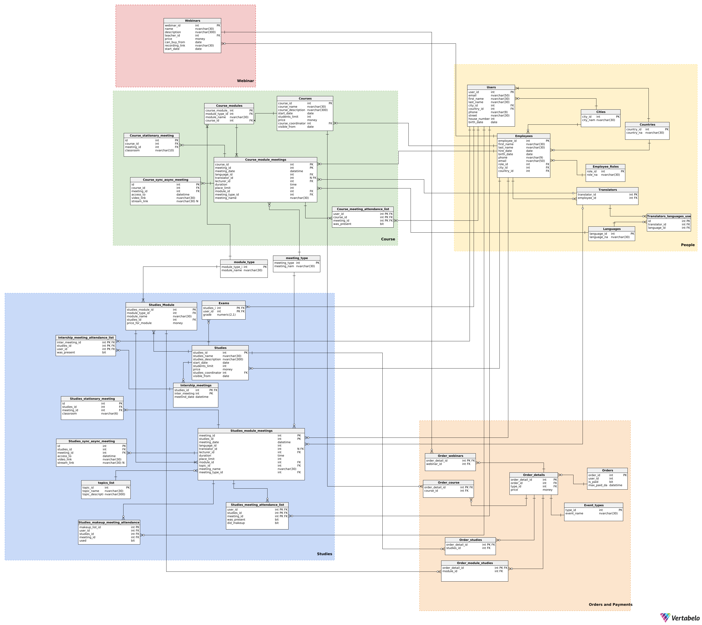

# Raport 5
Zespół 1  

Skład zespołu :  
Paweł Czajczyk  
Julia Demitraszek  
Szymon Rybski  # Opis funkcji systemu dla firmy oferującej kursy i szkolenia 

- [Raport 5](#raport-5)
  - [Role Użytkowników i Funkcje Systemu](#role-użytkowników-i-funkcje-systemu)
    - [1. Role Użytkowników](#1-role-użytkowników)
      - [Administrator](#administrator)
      - [Wykładowca](#wykładowca)
      - [Uczestnik (Student)](#uczestnik-student)
      - [Tłumacz](#tłumacz)
      - [Dyrektor Szkoły](#dyrektor-szkoły)
    - [2. Funkcje Systemu i Uprawnienia](#2-funkcje-systemu-i-uprawnienia)
      - [Funkcje ogólne](#funkcje-ogólne)
      - [Płatności](#płatności)
      - [Raportowanie i analiza](#raportowanie-i-analiza)
      - [Uczestnictwo i zarządzanie](#uczestnictwo-i-zarządzanie)
      - [Zarządzanie treścią](#zarządzanie-treścią)
- [Diagram bazy danych](#diagram-bazy-danych)
- [Kod do generowania bazy danych:](#kod-do-generowania-bazy-danych)
  - [Widoki w bazie danych](#widoki-w-bazie-danych)
    - [Wypisanie użytkowników, którzy ukończyli dane studia z wynikiem pozytywnym](#wypisanie-użytkowników-którzy-ukończyli-dane-studia-z-wynikiem-pozytywnym)
    - [Liczba zamówień dla poszczególnych użytkowników](#liczba-zamówień-dla-poszczególnych-użytkowników)
    - [Użytkownicy zapisani na dany kurs](#użytkownicy-zapisani-na-dany-kurs)
    - [Użytkownicy zapisani na dane studia](#użytkownicy-zapisani-na-dane-studia)
    - [Użytkownicy zapisani na dany webinar](#użytkownicy-zapisani-na-dany-webinar)
  - [Procedury w bazie danych](#procedury-w-bazie-danych)
    - [Sprawdzanie listy obecności dla kursu](#sprawdzanie-listy-obecności-dla-kursu)
    - [Odnajdywanie studentów, którzy nie byli obecni na spotkaniu](#odnajdywanie-studentów-którzy-nie-byli-obecni-na-spotkaniu)
    - [Sprawdzanie listy obecności dla studiów](#sprawdzanie-listy-obecności-dla-studiów)
    - [Sprawdzanie łącznej wartości zamówień](#sprawdzanie-łącznej-wartości-zamówień)
    - [Ustawianie obecności dla studenta](#ustawianie-obecności-dla-studenta)
    - [Dodanie nowego tematu](#dodanie-nowego-tematu)
    - [Dodanie nowego użytkownika](#dodanie-nowego-użytkownika)
    - [Dodanie nowego miasta](#dodanie-nowego-miasta)
    - [Dodanie nowego pracownika](#dodanie-nowego-pracownika)
    - [Dodanie nowego typu wydarzenia](#dodanie-nowego-typu-wydarzenia)
    - [Sprawdzenie czy użytkownik jest zapisany na kurs](#sprawdzenie-czy-użytkownik-jest-zapisany-na-kurs)
    - [Usuniecie studiów o danym indeksie](#usuniecie-studiów-o-danym-indeksie)
    - [Usuniecie użytkownika o danym indeksie](#usuniecie-użytkownika-o-danym-indeksie)
    - [Dodanie webinaru](#dodanie-webinaru)
  - [Funkcje w bazie danych](#funkcje-w-bazie-danych)
    - [Obliczanie średniej oceny dla użytkownika](#obliczanie-średniej-oceny-dla-użytkownika)
    - [Generowanie planu zajęć dla użytkownika](#generowanie-planu-zajęć-dla-użytkownika)
    - [Czy użytkownik uczestniczył w zajęciach o danym temacie](#czy-użytkownik-uczestniczył-w-zajęciach-o-danym-temacie)


## Role Użytkowników i Funkcje Systemu 

System zarządzający kursami i szkoleniami obsługuje różnorodne formy kształcenia, takie jak webinary, kursy, i studia. Poniżej znajduje się opis funkcji realizowanych przez system oraz zakres uprawnień poszczególnych użytkowników. 

### 1. Role Użytkowników 

#### Administrator 
- Zarządzanie wszystkimi danymi w systemie, w tym tworzenie, edycja i usuwanie kursów, webinarów oraz studiów. 
- Zarządzanie wszystkimi użytkownikami, w tym dodawanie użytkowników i ich usuwanie. 
- Przeglądanie i generowanie wszystkich dostępnych raportów. 
- Ustawianie wyjątków płatności, np. zgody na płatności odroczone(dla stałych użytkowników) - wyjątek musi być zaakceptowany przez dyrektora. 

#### Wykładowca 
- Zarządzanie harmonogramem oraz treściami kursów, webinarów oraz studiów, które prowadzi. 
- Przeglądanie listy uczestników swoich zajęć i zarządzanie ich obecnością. 
- Przeglądanie raportów związanych z prowadzonymi zajęciami, np. frekwencja uczestników. 
- Generowanie list obecności oraz raportów dotyczących frekwencji. 
- Przygotowanie sylabusu oraz harmonogramu zajęć dla studiów. 
- Możliwość oznaczenia odrobionych przez studenta zajęć 

#### Uczestnik (Student) 
- Rejestracja na kursy, webinary oraz studia. 
- Przeglądanie harmonogramów zapisanych kursów, webinarów oraz studiów. 
- Rejestracja na płatne pojedyncze spotkania w ramach studiów 
- Opłacanie kursów, webinarów oraz studiów poprzez zintegrowany system płatności. 
- Uczestnictwo w kursach online, oglądanie nagrań z kursów asynchronicznych, uczestnictwo w kursach stacjonarnych. 
- Przeglądanie ocen oraz dyplomów uzyskanych po zakończeniu kursów i studiów. 
- Możliwość zgłoszenia odrobienia nieobecności - do zatwierdzenia przez wykładowcę 
- Dodawanie wydarzeń, kursów, studiów i webinarów do koszyka i zarządzanie przedmiotami w koszyku 
- Dostęp do nagrań z webinarów przez 30 dni z możliwością wykupienia nagrań do zakończonych 
- Możliwość wystąpienia do dyrektora o zniżkę dla stałych klientów 
- Przeglądanie dotyczących użytkownika raportów bilokacji 
- Dostęp o informacji o swojej frekwencji i zaległych płatności 

#### Tłumacz 

- Przeglądanie harmonogramów zajęć, do których został przypisany. 
- Udział w tłumaczeniu na żywo webinarów oraz kursów. 
- Wgląd do harmonogramu

#### Dyrektor Szkoły 

- Zarządzanie wyjątkami płatnościowymi (np. odroczenie płatności). 
- Przeglądanie wszystkich raportów, w tym finansowych oraz frekwencji. 
- Zarządzanie dostępnością kursów i webinarów, decydowanie o limitach miejsc. 
- Tworzenie i edytowanie kursów, webinarów oraz studiów 
- Możliwość dodawania użytkowników i ich usuwania 
- Możliwość edytowania sylabusa 
- Możliwość spoglądania na listę dłużników 
- Generowanie raportu

### 2. Funkcje Systemu i Uprawnienia 

#### Funkcje ogólne 
- Rejestracja i logowanie użytkowników - Każdy użytkownik może założyć konto w systemie, logować się i edytować swoje dane profilowe. 
- Przeglądanie harmonogramu - Uczestnicy mogą przeglądać harmonogram swoich zajęć i dostosowywać dostępność do kursów. 
- Generowanie dyplomów - Po ukończeniu kursu lub studiów, system automatycznie generuje certyfikat/dyplom, który jest wysyłany Pocztą Polską na adres korespondencyjny. 
- Dodawanie kursów, webinarów i kierunków studiów
- Usuwanie możliwości dostępu do webinarów po 30 dniach 

#### Płatności 

- Obsługa płatności - System integruje się z zewnętrznym systemem płatności, umożliwiając płatności online za kursy, webinary oraz studia. 
- Generowanie koszyka - Uczestnik może dodawać produkty do koszyka, a następnie generowany jest link do płatności. 
- Śledzenie płatności - System śledzi statusy płatności (udane/nieudane) i aktualizuje dostęp uczestników do kursów i webinarów. 

#### Raportowanie i analiza 

- Generowanie raportów finansowych - Administrator i Dyrektor Szkoły mają dostęp do raportów finansowych dla webinarów, kursów oraz studiów. 
- Raporty dotyczące frekwencji - Wykładowca może generować raporty z frekwencji dla prowadzonych zajęć. 
- Lista dłużników - Administrator ma dostęp do listy uczestników, którzy nie dokonali wymaganych płatności. 
- Raport bilokacji - System automatycznie wykrywa uczestników zapisanych na kolidujące ze sobą szkolenia. 

#### Uczestnictwo i zarządzanie 

- Rejestracja na kursy - Uczestnicy mogą się rejestrować na kursy, webinary oraz studia, przy czym system zarządza dostępnością miejsc. 
- Możliwość wykreślenia się z listy kursantów/ studentów 
- Przydzielanie wykładowców i tłumaczy - Administrator przydziela wykładowców i tłumaczy do poszczególnych wydarzeń. 
- Ustawienia dostępności nagrań - Administrator i wykładowca mogą decydować, czy nagranie jest dostępne (płatne/darmowe) i przez jaki okres. 
- Ustawianie limitów miejsc dla kursów hybrydowych i stacjonarnych, czy studiów 
- Zmienianie limitów i możliwość dodawania osób z zewnątrz 
- Frekwencja i zaliczenia - System automatycznie monitoruje obecność uczestników i sprawdza, czy spełniają wymagania (np. 80% frekwencji). 

#### Zarządzanie treścią 

- Zarządzanie modułami kursów - Wykładowcy mają możliwość tworzenia, edytowania i usuwania modułów kursów. 
- Dodawanie nagrań i materiałów edukacyjnych - Wykładowcy mogą dodawać materiały edukacyjne i nagrania do swoich kursów. 
- Monitorowanie postępów - System śledzi postępy uczestników w zaliczaniu modułów, zarówno online, jak i stacjonarnych. 

 
# Diagram bazy danych


[diagram w wersji svg](https://bleidhu.github.io/Introduction__To_Databases_2024_AGH_Project/images/diagram.svg)

# Kod do generowania bazy danych:

```SQL
-- Created by Vertabelo (http://vertabelo.com)
-- Last modification date: 2024-12-17 22:38:54.732

-- tables
-- Table: Cities
CREATE TABLE Cities
(
    city_id   int          NOT NULL,
    city_name nvarchar(30) NOT NULL,
    CONSTRAINT Cities_pk PRIMARY KEY (city_id)
);

-- Table: Countries
CREATE TABLE Countries
(
    country_id   int          NOT NULL,
    country_name nvarchar(30) NOT NULL,
    CONSTRAINT Countries_pk PRIMARY KEY (country_id)
);

-- Table: Course_meeting_attendance_list
CREATE TABLE Course_meeting_attendance_list
(
    user_id     int NOT NULL,
    course_id   int NOT NULL,
    meeting_id  int NOT NULL,
    was_present bit NOT NULL,
    CONSTRAINT Course_meeting_attendance_list_pk PRIMARY KEY (user_id, meeting_id, course_id)
);

-- Reference: Course_meeting_attendance_list_Course_module_meetings (table: Course_meeting_attendance_list)
ALTER TABLE Course_meeting_attendance_list
    ADD CONSTRAINT Course_meeting_attendance_list_Course_module_meetings
        FOREIGN KEY (meeting_id, course_id)
            REFERENCES Course_module_meetings (meeting_id, course_id);

-- Reference: Course_meeting_attendance_list_Users (table: Course_meeting_attendance_list)
ALTER TABLE Course_meeting_attendance_list
    ADD CONSTRAINT Course_meeting_attendance_list_Users
        FOREIGN KEY (user_id)
            REFERENCES Users (user_id);


-- Table: Course_module_meeting_stationary
CREATE TABLE Course_module_meeting_stationary
(
    id         int          NOT NULL,
    course_id  int          NOT NULL,
    meeting_id int          NOT NULL,
    classroom  nvarchar(10) NOT NULL,
    CONSTRAINT Course_module_meeting_stationary_pk PRIMARY KEY (id)
);

-- Reference: Course_module_meetings_Course_module_meeting_stationary (table: Course_module_meeting_stationary)
ALTER TABLE Course_module_meeting_stationary
    ADD CONSTRAINT Course_module_meetings_Course_module_meeting_stationary
        FOREIGN KEY (meeting_id, course_id)
            REFERENCES Course_module_meetings (meeting_id, course_id);


-- Table: Course_module_meetings
CREATE TABLE Course_module_meetings
(
    course_id       int          NOT NULL,
    meeting_id      int          NOT NULL,
    meeting_date    datetime     NOT NULL,
    language_id     int          NOT NULL,
    translator_id   int          NOT NULL,
    lecturer_id     int          NOT NULL,
    duration        time         NOT NULL,
    place_limit     int          NOT NULL,
    module_id       int          NOT NULL,
    meeting_type_id int          NOT NULL,
    meeting_name    nvarchar(30) NOT NULL,
    CONSTRAINT place_limit CHECK (place_limit >= 0),
    CONSTRAINT Course_module_meetings_pk PRIMARY KEY (meeting_id, course_id)
);

-- Reference: Course_module_Course_module_meetings (table: Course_module_meetings)
ALTER TABLE Course_module_meetings
    ADD CONSTRAINT Course_module_Course_module_meetings
        FOREIGN KEY (module_id)
            REFERENCES module_type (module_type_id);

-- Reference: Course_module_meetings_Course_modules (table: Course_module_meetings)
ALTER TABLE Course_module_meetings
    ADD CONSTRAINT Course_module_meetings_Course_modules
        FOREIGN KEY (module_id)
            REFERENCES Course_modules (course_module_id);

-- Reference: Course_module_meetings_Employees (table: Course_module_meetings)
ALTER TABLE Course_module_meetings
    ADD CONSTRAINT Course_module_meetings_Employees
        FOREIGN KEY (lecturer_id)
            REFERENCES Employees (employee_id);

-- Reference: Course_module_meetings_Languages (table: Course_module_meetings)
ALTER TABLE Course_module_meetings
    ADD CONSTRAINT Course_module_meetings_Languages
        FOREIGN KEY (language_id)
            REFERENCES Languages (language_id);

-- Reference: Translators_Course_module_meetings (table: Course_module_meetings)
ALTER TABLE Course_module_meetings
    ADD CONSTRAINT Translators_Course_module_meetings
        FOREIGN KEY (translator_id)
            REFERENCES Translators (translator_id);

-- Reference: meeting_type_Course_module_meetings (table: Course_module_meetings)
ALTER TABLE Course_module_meetings
    ADD CONSTRAINT meeting_type_Course_module_meetings
        FOREIGN KEY (meeting_type_id)
            REFERENCES meeting_type (meeting_type_id);


-- Table: Course_modules
CREATE TABLE Course_modules
(
    course_module_id int      NOT NULL,
    module_type_id   int      NOT NULL,
    module_name      nvarchar NOT NULL,
    course_id        int      NOT NULL,
    CONSTRAINT course_module_id PRIMARY KEY (course_module_id)
);

-- Reference: Course_modules_module_type (table: Course_modules)
ALTER TABLE Course_modules
    ADD CONSTRAINT Course_modules_module_type
        FOREIGN KEY (module_type_id)
            REFERENCES module_type (module_type_id);

-- Reference: Courses_Course_modules (table: Course_modules)
ALTER TABLE Course_modules
    ADD CONSTRAINT Courses_Course_modules
        FOREIGN KEY (course_id)
            REFERENCES Courses (course_id);


-- Table: Course_sync_async_meeting
CREATE TABLE Course_sync_async_meeting
(
    id          int          NOT NULL,
    course_id   int          NOT NULL,
    meeting_id  int          NOT NULL,
    accessTo    datetime     NOT NULL,
    video_link  nvarchar(30) NOT NULL,
    stream_link nvarchar(30) NULL,
    CONSTRAINT Course_sync_async_meeting_pk PRIMARY KEY (id)
);


-- Reference: Course_video_access_Course_module_meetings (table: Course_sync_async_meeting)
ALTER TABLE Course_sync_async_meeting
    ADD CONSTRAINT Course_video_access_Course_module_meetings
        FOREIGN KEY (meeting_id, course_id)
            REFERENCES Course_module_meetings (meeting_id, course_id);

-- Table: Courses
CREATE TABLE Courses
(
    course_id             int           NOT NULL,
    course_name           nvarchar(30)  NOT NULL,
    course_description    nvarchar(300) NOT NULL,
    start_date            date          NOT NULL,
    students_limit        int           NOT NULL,
    price                 money         NOT NULL,
    course_coordinator_id int           NOT NULL,
    visible_from          date          NOT NULL,
    CONSTRAINT courses_price_check CHECK (price >= 0),
    CONSTRAINT Courses_pk PRIMARY KEY (course_id)
);
-- Reference: Courses_Employees (table: Courses)
ALTER TABLE Courses
    ADD CONSTRAINT Courses_Employees
        FOREIGN KEY (course_coordinator_id)
            REFERENCES Employees (employee_id);


-- Table: Employee_Roles
CREATE TABLE Employee_Roles
(
    role_id     int NOT NULL,
    employee_id int NOT NULL,
    role_name   int NOT NULL,
    CONSTRAINT Employee_Roles_pk PRIMARY KEY (role_id)
);

-- Table: Employees
CREATE TABLE Employees
(
    employee_id int          NOT NULL,
    first_name  nvarchar(30) NOT NULL,
    last_name   nvarchar(30) NOT NULL,
    hire_date   date         NOT NULL,
    birth_date  date         NOT NULL,
    phone       nvarchar(9)  NOT NULL CHECK ((PATINDEX('%[^0-9]%', phone) = 0 AND LEN(phone) = 9)),
    email       nvarchar(50) NOT NULL,
    role_id     int          NOT NULL,
    city_id     int          NOT NULL,
    country_id  int          NOT NULL,
    CONSTRAINT employee_birth_date_check CHECK (year(getdate()) - year(birth_date) < 100),
    CONSTRAINT Employees_pk PRIMARY KEY (employee_id)
);


-- Reference: Employees_Cities (table: Employees)
ALTER TABLE Employees
    ADD CONSTRAINT Employees_Cities
        FOREIGN KEY (city_id)
            REFERENCES Cities (city_id);

-- Reference: Employees_Countries (table: Employees)
ALTER TABLE Employees
    ADD CONSTRAINT Employees_Countries
        FOREIGN KEY (country_id)
            REFERENCES Countries (country_id);

-- Reference: Employees_Employee_Roles (table: Employees)
ALTER TABLE Employees
    ADD CONSTRAINT Employees_Employee_Roles
        FOREIGN KEY (role_id)
            REFERENCES Employee_Roles (role_id);


-- Table: Event_types
CREATE TABLE Event_types
(
    type_id    int          NOT NULL,
    event_name nvarchar(30) NOT NULL,
    CONSTRAINT Event_types_pk PRIMARY KEY (type_id)
);

-- Table: Exams
CREATE TABLE Exams
(
    studies_id int           NOT NULL,
    user_id    int           NOT NULL,
    grade      numeric(2, 1) NOT NULL,
    CONSTRAINT grade_check CHECK (grade in (2.0, 3.0, 3.5, 4.0, 4.5, 5.0)),
    CONSTRAINT Exams_pk PRIMARY KEY (studies_id, user_id)
);


-- Reference: Exams_Studies (table: Exams)
ALTER TABLE Exams
    ADD CONSTRAINT Exams_Studies
        FOREIGN KEY (studies_id)
            REFERENCES Studies (studies_id);

-- Reference: Exams_Users (table: Exams)
ALTER TABLE Exams
    ADD CONSTRAINT Exams_Users
        FOREIGN KEY (user_id)
            REFERENCES Users (user_id);


-- Table: Intership_meeting_attendance_list
CREATE TABLE Intership_meeting_attendance_list
(
    inter_meeting_id int NOT NULL,
    user_id          int NOT NULL,
    was_present      bit NOT NULL,
    CONSTRAINT Intership_meeting_attendance_list_pk PRIMARY KEY (inter_meeting_id, user_id)
);

-- Reference: Intership_meeting_attendance_list_Intership_meetings (table: Intership_meeting_attendance_list)
ALTER TABLE Intership_meeting_attendance_list
    ADD CONSTRAINT Intership_meeting_attendance_list_Intership_meetings
        FOREIGN KEY (inter_meeting_id)
            REFERENCES Intership_meetings (inter_meeting_id);

-- Reference: Intership_meeting_attendance_list_Users (table: Intership_meeting_attendance_list)
ALTER TABLE Intership_meeting_attendance_list
    ADD CONSTRAINT Intership_meeting_attendance_list_Users
        FOREIGN KEY (user_id)
            REFERENCES Users (user_id);

-- Table: Intership_meetings
CREATE TABLE Intership_meetings
(
    inter_meeting_id int      NOT NULL,
    studies_id       int      NOT NULL,
    intership_id     int      NOT NULL,
    meetind_date     datetime NOT NULL,
    CONSTRAINT Intership_meetings_pk PRIMARY KEY (inter_meeting_id)
);


-- Reference: Intership_meetings_Studies (table: Intership_meetings)
ALTER TABLE Intership_meetings
    ADD CONSTRAINT Intership_meetings_Studies
        FOREIGN KEY (studies_id)
            REFERENCES Studies (studies_id);


-- Table: Languages
CREATE TABLE Languages
(
    language_id   int          NOT NULL,
    language_name nvarchar(30) NOT NULL,
    CONSTRAINT Languages_pk PRIMARY KEY (language_id)
);

-- Table: Order_course
CREATE TABLE Order_course
(
    order_detail_id int NOT NULL,
    course_id       int NOT NULL,
    CONSTRAINT Order_course_pk PRIMARY KEY (order_detail_id)
);


-- Reference: Order_course_Courses (table: Order_course)
ALTER TABLE Order_course
    ADD CONSTRAINT Order_course_Courses
        FOREIGN KEY (course_id)
            REFERENCES Courses (course_id);

-- Reference: Order_course_Order_details (table: Order_course)
ALTER TABLE Order_course
    ADD CONSTRAINT Order_course_Order_details
        FOREIGN KEY (order_detail_id)
            REFERENCES Order_details (order_detail_id);


-- Table: Order_details
CREATE TABLE Order_details
(
    order_detail_id int NOT NULL,
    order_id        int NOT NULL,
    type_id         int NOT NULL,
    CONSTRAINT Order_details_pk PRIMARY KEY (order_detail_id)
);


-- Reference: Order_details_Event_types (table: Order_details)
ALTER TABLE Order_details
    ADD CONSTRAINT Order_details_Event_types
        FOREIGN KEY (type_id)
            REFERENCES Event_types (type_id);

-- Reference: Order_details_Orders (table: Order_details)
ALTER TABLE Order_details
    ADD CONSTRAINT Order_details_Orders
        FOREIGN KEY (order_id)
            REFERENCES Orders (order_id);


-- Table: Order_module_studies
CREATE TABLE Order_module_studies
(
    order_detail_id int NOT NULL,
    module_id       int NOT NULL,
    CONSTRAINT Order_module_studies_pk PRIMARY KEY (order_detail_id)
);


-- Reference: Order_meeting_studies_Order_details (table: Order_module_studies)
ALTER TABLE Order_module_studies
    ADD CONSTRAINT Order_meeting_studies_Order_details
        FOREIGN KEY (order_detail_id)
            REFERENCES Order_details (order_detail_id);

-- Reference: Studies_Module_Order_meeting_studies (table: Order_module_studies)
ALTER TABLE Order_module_studies
    ADD CONSTRAINT Studies_Module_Order_meeting_studies
        FOREIGN KEY (module_id)
            REFERENCES Studies_Module (studies_module_id);

-- Table: Order_studies
CREATE TABLE Order_studies
(
    order_detail_id int NOT NULL,
    studies_id      int NOT NULL,
    CONSTRAINT Order_studies_pk PRIMARY KEY (order_detail_id)
);

-- Reference: Order_studies_Order_details (table: Order_studies)
ALTER TABLE Order_studies
    ADD CONSTRAINT Order_studies_Order_details
        FOREIGN KEY (order_detail_id)
            REFERENCES Order_details (order_detail_id);

-- Reference: Order_studies_Studies (table: Order_studies)
ALTER TABLE Order_studies
    ADD CONSTRAINT Order_studies_Studies
        FOREIGN KEY (studies_id)
            REFERENCES Studies (studies_id);


-- Table: Order_webinars
CREATE TABLE Order_webinars
(
    order_detail_id int NOT NULL,
    webinar_id      int NOT NULL,
    CONSTRAINT Order_webinars_pk PRIMARY KEY (order_detail_id)
);

-- Reference: Order_webinars_Order_details (table: Order_webinars)
ALTER TABLE Order_webinars
    ADD CONSTRAINT Order_webinars_Order_details
        FOREIGN KEY (order_detail_id)
            REFERENCES Order_details (order_detail_id);

-- Reference: Order_webinars_Webinar_info (table: Order_webinars)
ALTER TABLE Order_webinars
    ADD CONSTRAINT Order_webinars_Webinar_info
        FOREIGN KEY (webinar_id)
            REFERENCES Webinar_info (webinar_id);


-- Table: Orders
CREATE TABLE Orders
(
    order_id      int      NOT NULL,
    user_id       int      NOT NULL,
    is_paid       bit      NOT NULL,
    price         money    NOT NULL,
    max_paid_date datetime NOT NULL,
    CONSTRAINT orders_price_check CHECK (price >= 0),
    CONSTRAINT Orders_pk PRIMARY KEY (order_id)
);

-- Table: Studies
CREATE TABLE Studies
(
    studies_id             int           NOT NULL,
    studies_name           nvarchar(30)  NOT NULL,
    studies_description    nvarchar(300) NOT NULL,
    start_date             date          NOT NULL,
    students_limit         int           NOT NULL,
    price                  money         NOT NULL,
    studies_coordinator_id int           NOT NULL,
    visible_from           date          NOT NULL,
    CONSTRAINT studies_price_check CHECK (price >= 0),
    CONSTRAINT Studies_pk PRIMARY KEY (studies_id)
);

-- Reference: Studies_Employees (table: Studies)
ALTER TABLE Studies
    ADD CONSTRAINT Studies_Employees
        FOREIGN KEY (studies_coordinator_id)
            REFERENCES Employees (employee_id);


-- Table: Studies_Module
CREATE TABLE Studies_Module
(
    studies_module_id        int          NOT NULL,
    module_type_id           int          NOT NULL,
    module_name              nvarchar(30) NOT NULL,
    studies_id               int          NOT NULL,
    price_for_free_listeners money        NOT NULL,
    CONSTRAINT price_check CHECK (price_for_free_listeners >= 0),
    CONSTRAINT studies_module_id PRIMARY KEY (studies_module_id)
);

-- Reference: Studiies_Module_Studies (table: Studies_Module)
ALTER TABLE Studies_Module
    ADD CONSTRAINT Studiies_Module_Studies
        FOREIGN KEY (studies_id)
            REFERENCES Studies (studies_id);

-- Reference: Studiies_Module_module_type (table: Studies_Module)
ALTER TABLE Studies_Module
    ADD CONSTRAINT Studiies_Module_module_type
        FOREIGN KEY (module_type_id)
            REFERENCES module_type (module_type_id);


-- Table: Studies_makeup_meeting_attendance_list
CREATE TABLE Studies_makeup_meeting_attendance_list
(
    makeup_list_id int NOT NULL,
    user_id        int NOT NULL,
    studies_id     int NOT NULL,
    meeting_id     int NOT NULL,
    topic_id       int NOT NULL,
    CONSTRAINT Studies_makeup_meeting_attendance_list_pk PRIMARY KEY (makeup_list_id)
);

-- Reference: Studies_makeup_meeting_attendacne_list_Studies_module_meetings (table: Studies_makeup_meeting_attendance_list)
ALTER TABLE Studies_makeup_meeting_attendance_list
    ADD CONSTRAINT Studies_makeup_meeting_attendacne_list_Studies_module_meetings
        FOREIGN KEY (meeting_id, studies_id)
            REFERENCES Studies_module_meetings (meeting_id, studies_id);

-- Reference: Studies_makeup_meeting_attendacne_list_Users (table: Studies_makeup_meeting_attendance_list)
ALTER TABLE Studies_makeup_meeting_attendance_list
    ADD CONSTRAINT Studies_makeup_meeting_attendacne_list_Users
        FOREIGN KEY (user_id)
            REFERENCES Users (user_id);

-- Table: Studies_meeting_attendance_list
CREATE TABLE Studies_meeting_attendance_list
(
    user_id     int NOT NULL,
    studies_id  int NOT NULL,
    meeting_id  int NOT NULL,
    was_present bit NOT NULL,
    topic_id    int NOT NULL,
    CONSTRAINT Studies_meeting_attendance_list_pk PRIMARY KEY (user_id, studies_id, meeting_id)
);


-- Reference: Studies_meeting_attendance_list_Studies_module_meetings (table: Studies_meeting_attendance_list)
ALTER TABLE Studies_meeting_attendance_list
    ADD CONSTRAINT Studies_meeting_attendance_list_Studies_module_meetings
        FOREIGN KEY (meeting_id, studies_id)
            REFERENCES Studies_module_meetings (meeting_id, studies_id);

-- Reference: Studies_meeting_attendance_list_Users (table: Studies_meeting_attendance_list)
ALTER TABLE Studies_meeting_attendance_list
    ADD CONSTRAINT Studies_meeting_attendance_list_Users
        FOREIGN KEY (user_id)
            REFERENCES Users (user_id);


-- Table: Studies_module_meeting_stationary
CREATE TABLE Studies_module_meeting_stationary
(
    id         int         NOT NULL,
    studies_id int         NOT NULL,
    meeting_id int         NOT NULL,
    classroom  nvarchar(6) NOT NULL,
    CONSTRAINT Studies_module_meeting_stationary_pk PRIMARY KEY (id)
);


-- Reference: Studies_module_meeting_stationary_Studies_module_meetings (table: Studies_module_meeting_stationary)
ALTER TABLE Studies_module_meeting_stationary
    ADD CONSTRAINT Studies_module_meeting_stationary_Studies_module_meetings
        FOREIGN KEY (meeting_id, studies_id)
            REFERENCES Studies_module_meetings (meeting_id, studies_id);

-- Table: Studies_module_meetings
CREATE TABLE Studies_module_meetings
(
    meeting_id      int          NOT NULL,
    studies_id      int          NOT NULL,
    meeting_date    datetime     NOT NULL,
    language_id     nvarchar(30) NOT NULL,
    translator_id   int          NOT NULL,
    lecturer_id     int          NOT NULL,
    duration        time         NOT NULL,
    place_limit     int          NOT NULL,
    module_id       int          NOT NULL,
    topic_id        int          NOT NULL,
    meeting_name    nvarchar(30) NOT NULL,
    meeting_type_id int          NOT NULL,
    CONSTRAINT Studies_module_meetings_pk PRIMARY KEY (meeting_id, studies_id)
);


-- Reference: Studies_module_meetings_Employees (table: Studies_module_meetings)
ALTER TABLE Studies_module_meetings
    ADD CONSTRAINT Studies_module_meetings_Employees
        FOREIGN KEY (lecturer_id)
            REFERENCES Employees (employee_id);

-- Reference: Studies_module_meetings_Studiies_Module (table: Studies_module_meetings)
ALTER TABLE Studies_module_meetings
    ADD CONSTRAINT Studies_module_meetings_Studiies_Module
        FOREIGN KEY (module_id)
            REFERENCES Studies_Module (studies_module_id);

-- Reference: Studies_module_meetings_Translators (table: Studies_module_meetings)
ALTER TABLE Studies_module_meetings
    ADD CONSTRAINT Studies_module_meetings_Translators
        FOREIGN KEY (translator_id)
            REFERENCES Translators (translator_id);

-- Reference: Studies_module_meetings_meeting_type (table: Studies_module_meetings)
ALTER TABLE Studies_module_meetings
    ADD CONSTRAINT Studies_module_meetings_meeting_type
        FOREIGN KEY (meeting_type_id)
            REFERENCES meeting_type (meeting_type_id);

-- Reference: module_type_Studies_module_meetings (table: Studies_module_meetings)
ALTER TABLE Studies_module_meetings
    ADD CONSTRAINT module_type_Studies_module_meetings
        FOREIGN KEY (module_id)
            REFERENCES module_type (module_type_id);

-- Reference: topics_list_Studies_module_meetings (table: Studies_module_meetings)
ALTER TABLE Studies_module_meetings
    ADD CONSTRAINT topics_list_Studies_module_meetings
        FOREIGN KEY (topic_id)
            REFERENCES topics_list (topic_id);


-- Table: Studies_sync_async_meeting
CREATE TABLE Studies_sync_async_meeting
(
    id          int          NOT NULL,
    studies_id  int          NOT NULL,
    meeting_id  int          NOT NULL,
    accessTo    datetime     NOT NULL,
    video_link  nvarchar(30) NOT NULL,
    stream_link nvarchar(30) NOT NULL,
    CONSTRAINT Studies_sync_async_meeting_pk PRIMARY KEY (id)
);

-- Reference: Studies_sync_async_meeting_Studies_module_meetings (table: Studies_sync_async_meeting)
ALTER TABLE Studies_sync_async_meeting
    ADD CONSTRAINT Studies_sync_async_meeting_Studies_module_meetings
        FOREIGN KEY (meeting_id, studies_id)
            REFERENCES Studies_module_meetings (meeting_id, studies_id);

-- Table: Translators
CREATE TABLE Translators
(
    translator_id int NOT NULL,
    employee_id   int NOT NULL,
    CONSTRAINT Translators_pk PRIMARY KEY (translator_id)
);


-- Reference: Translators_Employees (table: Translators)
ALTER TABLE Translators
    ADD CONSTRAINT Translators_Employees
        FOREIGN KEY (employee_id)
            REFERENCES Employees (employee_id);

-- Table: Translators_languages_used
CREATE TABLE Translators_languages_used
(
    id            int NOT NULL,
    translator_id int NOT NULL,
    language_id   int NOT NULL,
    CONSTRAINT Translators_languages_used_pk PRIMARY KEY (id)
);

-- Reference: Translators_languages_used_Languages (table: Translators_languages_used)
ALTER TABLE Translators_languages_used
    ADD CONSTRAINT Translators_languages_used_Languages
        FOREIGN KEY (language_id)
            REFERENCES Languages (language_id);

-- Reference: Translators_languages_used_Translators (table: Translators_languages_used)
ALTER TABLE Translators_languages_used
    ADD CONSTRAINT Translators_languages_used_Translators
        FOREIGN KEY (translator_id)
            REFERENCES Translators (translator_id);

-- Table: Users
CREATE TABLE Users
(
    user_id      int          NOT NULL,
    email        nvarchar(50) NOT NULL,
    first_name   nvarchar(30) NOT NULL,
    last_name    nvarchar(30) NOT NULL,
    city_id      int          NOT NULL,
    country_id   int          NOT NULL,
    phone        nvarchar(9)  NOT NULL CHECK (PATINDEX('%[^0-9]%', phone) = 0 AND LEN(phone) = 9),
    street       nvarchar(30) NOT NULL,
    house_number int          NOT NULL,
    birth_date   date         NOT NULL,
    CONSTRAINT users_birth_date_check CHECK (datediff(year, birth_date, getdate()) < 100),
    CONSTRAINT Users_pk PRIMARY KEY (user_id)
);
ALTER TABLE Users
    ADD CONSTRAINT Cities_Users
        FOREIGN KEY (city_id)
            REFERENCES Cities (city_id);

-- Reference: Countries_Users (table: Users)
ALTER TABLE Users
    ADD CONSTRAINT Countries_Users
        FOREIGN KEY (country_id)
            REFERENCES Countries (country_id);


-- Table: Webinar_info
CREATE TABLE Webinar_info
(
    webinar_id     int          NOT NULL,
    teacher_id     int          NOT NULL,
    price          money        NOT NULL,
    can_buy_from   date         NOT NULL,
    recording_link nvarchar(30) NOT NULL,
    start_date     date         NOT NULL,
    CONSTRAINT webinar_price_check CHECK (price >= 0),
    CONSTRAINT Webinar_info_pk PRIMARY KEY (webinar_id)
);

-- Reference: Webinar_info_Employees (table: Webinar_info)
ALTER TABLE Webinar_info
    ADD CONSTRAINT Webinar_info_Employees
        FOREIGN KEY (teacher_id)
            REFERENCES Employees (employee_id);

-- Table: meeting_type
CREATE TABLE meeting_type
(
    meeting_type_id int          NOT NULL,
    meeting_type    nvarchar(30) NOT NULL,
    CONSTRAINT meeting_type_pk PRIMARY KEY (meeting_type_id)
);

-- Table: module_type
CREATE TABLE module_type
(
    module_type_id int          NOT NULL,
    module_name    nvarchar(30) NOT NULL,
    module_type    nvarchar(30) NOT NULL,
    CONSTRAINT module_type_pk PRIMARY KEY (module_type_id)
);

-- Table: topics_list
CREATE TABLE topics_list
(
    topic_id          int          NOT NULL,
    topic_name        nvarchar(30) NOT NULL,
    topic_description nvarchar(30) NOT NULL,
    CONSTRAINT topics_list_pk PRIMARY KEY (topic_id)
);

-- End of file.


```
## Widoki w bazie danych


### Liczba zamówień dla poszczególnych użytkowników
```sql 
create view dbo.number_of_orders_by_user as
    with what_user_ordered as (select Orders.user_id,
                                      Order_details.order_detail_id
                               from Orders
                                        inner join
                                    Order_details
                                    on
                                        Orders.order_id = Order_details.order_id),
         order_webinars_ as (select what_user_ordered.user_id,
                                    count(Order_webinars.webinar_id) as c
                             from what_user_ordered
                                      inner join
                                  Order_webinars
                                  on
                                      Order_webinars.order_detail_id = what_user_ordered.order_detail_id
                             group by what_user_ordered.user_id),
         order_studies_ as (select what_user_ordered.user_id,
                                   count(Order_studies.studies_id) as c
                            from what_user_ordered
                                     inner join
                                 dbo.Order_studies
                                 on
                                     Order_studies.order_detail_id = what_user_ordered.order_detail_id
                            group by what_user_ordered.user_id),
         order_modules_ as (select what_user_ordered.user_id,
                                   count(Order_module_studies.module_id) as c
                            from what_user_ordered
                                     inner join
                                 dbo.Order_module_studies
                                 on
                                     Order_module_studies.order_detail_id = what_user_ordered.order_detail_id
                            group by what_user_ordered.user_id),
         order_course_ as (select what_user_ordered.user_id,
                                  count(Order_course.course_id) as c
                           from what_user_ordered
                                    inner join
                                dbo.Order_course
                                on
                                    Order_course.order_detail_id = what_user_ordered.order_detail_id
                           group by what_user_ordered.user_id)
    select t.user_id, sum(t.c) as order_count
    from (select *
          from order_studies_
          union
          select *
          from order_modules_
          union
          select *
          from order_webinars_
          union
          select *
          from order_course_) as t
    group by t.user_id
go
```

### Użytkownicy zapisani na dany kurs

```sql
create view dbo.courses_enrolled_list as
    select course_id, user_id
    from Order_course oc
             inner join Order_details od on oc.order_detail_id = od.order_detail_id
             inner join Orders o on od.order_id = o.order_id
    where o.is_paid = 1
       or (getdate() < max_paid_date)
go

```

### Użytkownicy zapisani na dane studia

```sql 
create view dbo.studies_enrolled_list as
    select studies_id, user_id
    from Order_studies os
             inner join Order_details od on os.order_detail_id = od.order_detail_id
             inner join Orders o on od.order_id = o.order_id
    where o.is_paid = 1
       or (getdate() < max_paid_date)
go
```

### Użytkownicy zapisani na dany webinar

```sql 
create view dbo.webinar_enrolled_list as
    select webinar_id, user_id
    from Order_webinars ow
             inner join Order_details od on ow.order_detail_id = od.order_detail_id
             inner join Orders o on od.order_id = o.order_id
    where o.is_paid = 1
       or (getdate() < max_paid_date)
go

```


## Procedury w bazie danych

### Dodanie produktu do istniejącego zamówienia
```sql
-- dodanie produktu do ISTNIEJACEGO zamówienia
create procedure add_product_to_order @order_id int, @product_id int, @product_type_id int
as
begin
    declare @is_order_exists bit;
    declare @is_product_exists bit;
    declare @product_type varchar(50);
    declare @product_price decimal(10, 2);
    declare @order_detail_id int;

    -- Sprawdzenie, czy zamówienie istnieje
    select @is_order_exists = case
                                  when exists (select 1
                                               from dbo.orders
                                               where order_id = @order_id) then 1
                                  else 0 end;

--     sprawdzenie typu produktu
    select @product_type = event_name from Event_types where type_id = @product_type_id;
    if @product_type is null
        begin
            RAISERROR ('Nieprawidłowy typ produktu.', 16, 1);
            return;
        end

--     jeśli zamówienie istnieje i typ produktu jest ok
    if @is_order_exists = 1
        begin
            -- Sprawdzenie, czy produkt istnieje
            select @is_product_exists = case
                                            when @product_type = 'Webinar' then
                                                IIF(exists (select 1
                                                            from dbo.webinars
                                                            where webinar_id = @product_id), 1, 0)
                                            when @product_type = 'Course' then
                                                IIF(exists (select 1
                                                            from dbo.courses
                                                            where course_id = @product_id), 1, 0)
                                            when @product_type = 'Studies' then
                                                IIF(exists (select 1
                                                            from dbo.studies
                                                            where studies_id = @product_id), 1, 0)
                                            when @product_type = 'Study_Module' then
                                                IIF(exists (select 1
                                                            from dbo.Studies_Module
                                                            where studies_module_id = @product_id), 1, 0)
                                            else 0
                end
        end
    else
        begin
            RAISERROR ('Zamówienie o podanym ID nie istnieje.', 16, 1);
            return 0;
        end

--  jeśli produkt istnieje
    if @is_product_exists = 1
        begin
            --             pobranie ceny produktu
            select @product_price = case
                                        when @product_type = 'Webinar' then
                                                (select price from webinars where webinar_id = @product_id)
                                        when @product_type = 'Course' then
                                                (select price from courses where course_id = @product_id)
                                        when @product_type = 'Studies' then
                                                (select price from studies where studies_id = @product_id)
                                        when @product_type = 'Study_Module' then
                                            (select price_for_module
                                             from Studies_Module
                                             where studies_module_id = @product_id)
                                        else 0
                end

--            dodanie produktu do order_details
            insert into Order_details (order_id, type_id, price)
            values (@order_id, @product_type_id, @product_price);
            select @order_detail_id = SCOPE_IDENTITY();

--           dodanie zakupu do odpowiedniej tabeli
            if @product_type = 'Webinar'
                begin
                    --                     id z order_details i id webinaru
                    insert into Order_webinars (order_detail_id, webinar_id)
                    values ((select order_detail_id
                             from Order_details
                             where order_id = @order_id
                               and type_id = @product_type_id), @product_id);
                end

--            jesli to kurs i dodatkowo czy są wolne miejsca
            if @product_type = 'Course'
                begin
                    if dbo.check_course_places_left(@product_id) > 0
                        begin
                            insert into Order_course (order_detail_id, course_id)
                            values (@order_detail_id, @product_id);
                        end
                    else
                        begin
                            RAISERROR ('Brak miejsc na kurs.', 16, 1);
                            return;
                        end
                end


            if @product_type = 'Studies'
                begin
                    if dbo.check_studies_places_left(@product_id) > 0
                        begin
                            insert into Order_studies (order_detail_id, studies_id)
                            values (@order_detail_id, @product_id);
                        end
                    else
                        begin
                            RAISERROR ('Brak miejsc na studia.', 16, 1);
                            return;
                        end
                end


--             dla modułów bez limitu miejsc
            if @product_type = 'Study_Module'
                begin
                    insert into Order_module_studies (order_detail_id, module_id)
                    values (@order_detail_id, @product_id);
                end
        end
    else
        begin
            RAISERROR ('Produkt o podanym ID nie istnieje.', 16, 1);
            return;
        end
    select * from Order_details where order_id = @order_id;
end
```


### Sprawdzanie listy obecności dla kursu (sprawdzanie przez prowadzącego)

```sql
CREATE PROCEDURE update_course_attendance @user_id INT,
                                         @course_id INT,
                                         @meeting_id INT
AS
BEGIN
    DECLARE @is_enrolled BIT;

    -- Sprawdzenie, czy użytkownik jest zapisany na kurs
    SELECT @is_enrolled = CASE
                              WHEN EXISTS (SELECT 1
                                           FROM dbo.courses_enrolled_list
                                           WHERE user_id = @user_id
                                             AND course_id = @course_id) THEN 1
                              ELSE 0 END;

    IF @is_enrolled = 1
        BEGIN
            insert into Course_meeting_attendance_list (user_id, course_id, meeting_id, was_present)
            values (@user_id, @course_id, @meeting_id, 1);
        END


END;
```

### Dla wszystkich użytkowników, którzy nie maja zaznaczonej obencości na zajęciach ustaw, że byli na nich nieobecni

```sql
CREATE PROCEDURE update_students_that_missed_meeting @studies_id INT,
                                                        @meeting_id INT
AS
BEGIN
    set nocount on;

--     dla wszystkich uzytkowników zapisanych na studia @studies_id, którzy nie byli obecni na spotkaniu @meeting_id dodaj ich brak obecnosci do listy
    insert into Studies_meeting_attendance_list (user_id, studies_id, meeting_id, was_present)
    select el.user_id, @studies_id, @meeting_id, 0
    from studies_enrolled_list el
    where el.studies_id = @studies_id
      and el.user_id not in (select user_id
                             from Studies_meeting_attendance_list
                             where studies_id = @studies_id
                               and meeting_id = @meeting_id);


END;
```

### Sprawdzanie listy obecności dla studiów

```sql
CREATE PROCEDURE check_studies_attendance @user_id INT,
                                          @studies_id INT,
                                          @meeting_id INT
AS
BEGIN
    DECLARE @is_enrolled BIT;

    -- Sprawdzenie, czy użytkownik jest zapisany na studia
    SELECT @is_enrolled = CASE
                              WHEN EXISTS (SELECT 1
                                           FROM dbo.studies_enrolled_list
                                           WHERE user_id = @user_id
                                             AND studies_id = @studies_id) THEN 1
                              ELSE 0 END;

    IF @is_enrolled = 1
        BEGIN
            insert into Studies_meeting_attendance_list (user_id, studies_id, meeting_id, was_present)
            values (@user_id, @studies_id, @meeting_id, 1);
        END
    ELSE
        BEGIN
            insert into Studies_makeup_meeting_attendance_list (user_id, studies_id, meeting_id)
            values (@user_id, @studies_id, @meeting_id);
        END

END;
```

### Sprawdzanie łącznej wartości zamówień

```sql
create procedure get_total_order_cost @order_id int
as
begin
    declare @total_cost float
    select @total_cost = sum(price) from Order_details where order_id = @order_id
    return @total_cost
end
```

### Ustawianie obecności dla studenta
```sql
-- jesli uzytkownik ma jakies odrobione zajecia z tym samym tematem co przesłane to ustaw ze odrobil zajecia
-- oraz odrobienia oznacz jako "zuzyte"

CREATE PROCEDURE set_attendance_for_student_that_makeup_meeting @studies_id INT,
                                                                @meeting_id INT,
                                                                @user_id INT
AS
BEGIN
    declare @makeup_meeting_id INT;
    declare @topic_id INT;

    select @topic_id = topic_id
    from Studies_module_meetings
    where meeting_id = @meeting_id
      and studies_id = @studies_id;

    select top 1 @makeup_meeting_id = makeup_list_id
    from Studies_makeup_meeting_attendance_list smmal
             join Studies_module_meetings smm on smmal.meeting_id = smm.meeting_id and smmal.studies_id = smm.studies_id
    where topic_id = @topic_id
      and user_id = @user_id
      and smmal.used = 0;

    if @makeup_meeting_id is not null
        begin
            update Studies_makeup_meeting_attendance_list set used = 1 where makeup_list_id = @makeup_meeting_id;

            update Studies_meeting_attendance_list
            set did_makeup = 1
            where meeting_id = @meeting_id
              and studies_id = @studies_id
              and user_id = @user_id;
            return 0;
        end
    else
        begin
--             jednak zwracanie succes/failure bo wykorzystujemy w check_user_attendance
            return 1;
--             raiserror ('Student did not make up the meeting', 16, 1);

        end


END;
```

### Dodanie nowego tematu 
``` sql
create procedure add_topic(
    @topic_name nvarchar(30),
    @topic_description nvarchar(30)
)
as
begin
    if not exists (
        select 1
        from dbo.topics_list
        where topic_name = @topic_name
    )
    begin
        insert into dbo.topics_list (topic_name, topic_description)
        values (@topic_name, @topic_description);
    end
end;
```

### Dodanie nowego użytkownika

```sql 
CREATE PROCEDURE add_user
    @Email NVARCHAR(50),
    @FirstName NVARCHAR(30),
    @LastName NVARCHAR(30),
    @CityID INT,
    @CountryID INT,
    @Phone NVARCHAR(9),
    @Street NVARCHAR(30),
    @HouseNumber INT,
    @BirthDate DATE
AS
BEGIN
        IF DATEDIFF(YEAR, @BirthDate, GETDATE()) >= 100
        BEGIN
            THROW 50003, 'User must be less than 100 years old.', 16;
        END

        IF PATINDEX('%[^0-9]%', @Phone) > 0 OR LEN(@Phone) <> 9
        BEGIN
            THROW 50004,'Phone number must be exactly 9 numeric characters.', 16;
        END

        INSERT INTO Users (
            email, first_name, last_name, city_id, country_id, phone, street, house_number, birth_date
        )
        VALUES (
            @Email, @FirstName, @LastName, @CityID, @CountryID, @Phone, @Street, @HouseNumber, @BirthDate
        );
END;

```

### Dodanie nowego miasta

``` sql
CREATE PROCEDURE add_city
    @CityName NVARCHAR(30) 
AS
BEGIN
                            -- obciecie lewych i prawych spacji
    IF @CityName IS NULL OR LTRIM(RTRIM(@CityName)) = ''
    BEGIN
        THROW 50005, 'City name cannot be empty', 16;
    END

    BEGIN
        INSERT INTO Cities (city_name)
        VALUES (@CityName);
    END
END;
GO
``` 

### Dodanie nowego pracownika

```sql 
CREATE PROCEDURE add_employee(
    @FirstName NVARCHAR(30),
    @LastName NVARCHAR(30),
    @HireDate DATE,
    @BirthDate DATE,
    @Phone NVARCHAR(9),
    @Email NVARCHAR(50),
    @RoleID INT,
    @CityID INT,
    @CountryID INT
)
AS
BEGIN
      INSERT INTO Employees (
         first_name,
         last_name,
         hire_date,
         birth_date,
         phone,
         email,
         role_id,
         city_id,
         country_id
      )
      VALUES (
         @FirstName,
         @LastName,
         @HireDate,
         @BirthDate,
         @Phone,
         @Email,
         @RoleID,
         @CityID,
         @CountryID
      );
   END;

```

### Dodanie nowego typu wydarzenia

```sql 
CREATE PROCEDURE add_event_type
    @event_name NVARCHAR(30)
AS
BEGIN
    BEGIN
        INSERT INTO Event_types (event_name)
        VALUES (@event_name);

    END
END;
```

### Sprawdzenie czy użytkownik jest zapisany na kurs

``` sql
CREATE PROCEDURE check_course_attendance
    @user_id INT,
    @course_id INT,
    @meeting_id INT
AS
BEGIN
    DECLARE @is_enrolled BIT;

    -- Sprawdzenie, czy użytkownik jest zapisany na kurs
    SELECT @is_enrolled = CASE WHEN EXISTS (
        SELECT 1
        FROM dbo.courses_enrolled_list
        WHERE user_id = @user_id AND course_id = @course_id
    ) THEN 1 ELSE 0 END;

    IF @is_enrolled = 1
        BEGIN
            insert into Course_meeting_attendance_list (user_id, course_id, meeting_id, was_present)
            values (@user_id, @course_id, @meeting_id, 1);
        END
    ELSE
        BEGIN
            PRINT 'Użytkownik nie jest zapisany na kurs!';
        END
END;
go
```


### Usuniecie studiów o danym indeksie
```sql 
CREATE PROCEDURE delete_study
    @study_id INT
AS
BEGIN
    SET NOCOUNT ON;

    IF NOT EXISTS (SELECT 1 FROM Studies WHERE studies_id = @study_id)
    BEGIN
        PRINT 'Nie znaleziono studiow';
        RETURN;
    END

    DELETE FROM Studies
    WHERE studies_id = @study_id;

    PRINT 'Studia usuniete';
END

```

### Usuniecie użytkownika o danym indeksie
```sql 
CREATE PROCEDURE delete_user
    @user_id INT
AS
BEGIN
    SET NOCOUNT ON;

    IF NOT EXISTS (SELECT 1 FROM Users WHERE user_id = @user_id)
    BEGIN
        PRINT 'Uzytkownik nie znaleziony';
        RETURN;
    END

    DELETE FROM Users
    WHERE user_id = @user_id;

    PRINT 'Uzytkownik usuniety';
END

``` 

### Dodanie webinaru 

```sql 
CREATE PROCEDURE add_webinar
    @name nvarchar(30),
    @description nvarchar(300),
    @teacher_id int,
    @price money,
    @can_buy_from date,
    @recording_link nvarchar(30),
    @start_date date
AS
BEGIN
    
    IF @price < 0
    BEGIN
        THROW 50010, 'Cena musi być dodatnia', 16;
        RETURN;
    END

    INSERT INTO Webinars (name, description, teacher_id, price, can_buy_from, recording_link, start_date)
    VALUES (@name, @description, @teacher_id, @price, @can_buy_from, @recording_link, @start_date);

    PRINT 'Webinar został dodany';
END;

``` 

### sprawdz % frekwencji danego studenta na zajeciach (wersja procedura, funckja - nizej)
```sql

create procedure get_user_attendance_procedure  @studies_id int, @user_id int, @result float output
as
begin
    declare @meeting_id int;
    declare @was_present bit;
    declare @did_makeup bit;
    declare @total_meetings int = 0;
    declare @present_meetings int = 0;

    declare @status int;

    declare attendance_cursor cursor for
        select meeting_id, was_present, did_makeup
        from Studies_meeting_attendance_list
        where studies_id = @studies_id
          and user_id = @user_id;

--     dla kazdego rekordu w attendance_list sprawdz czy student byl obecny, jesli nie to sprawdz czy odrobil zajecia
    open attendance_cursor;
    fetch next from attendance_cursor into @meeting_id, @was_present, @did_makeup;
    while @@fetch_status = 0
        begin
            if @was_present = 1
                set @present_meetings = @present_meetings + 1;
            else
                if @did_makeup = 1
                    set @present_meetings = @present_meetings + 1;
                else
                    begin
                        --   jesli student nie byl obecny i nie odrobil zajec to sprawdz czy ma odrobione zajecia
                        exec @status = set_attendance_for_student_that_makeup_meeting
                                    @studies_id,
                                    @meeting_id,
                                       @user_id;
                        if @status = 0
                            begin
                                set @present_meetings = @present_meetings + 1;
                            end

                    end
            set @total_meetings = @total_meetings + 1;
            fetch next from attendance_cursor into @meeting_id, @was_present, @did_makeup;
        end
    close attendance_cursor;
    deallocate attendance_cursor;

    if @total_meetings = 0
        set @result = 0;
    else
        set @result = @present_meetings / @total_meetings;
end
```

## Funkcje w bazie danych

### Sprawdz frekwencje studenta na studiach
```sql
CREATE FUNCTION get_user_attendance_percentage
(
    @studies_id INT,
    @user_id INT
)
    RETURNS FLOAT
AS
BEGIN
    DECLARE @total_meetings INT;
    DECLARE @present_meetings INT;

    SELECT @total_meetings = COUNT(*)
    FROM Studies_module_meetings
    WHERE studies_id = @studies_id;

    SELECT @present_meetings = COUNT(*)
    FROM Studies_meeting_attendance_list
    WHERE studies_id = @studies_id
      AND user_id = @user_id
      AND (was_present = 1 OR did_makeup = 1);

    -- Jeśli brak spotkań, zwróć 0 (unikamy dzielenia przez 0)
    IF @total_meetings = 0
        RETURN 0;

    -- Zwróć procent obecności
    RETURN CAST(@present_meetings AS FLOAT) / CAST(@total_meetings AS FLOAT) * 100;
END;

```

### Obliczanie średniej oceny dla użytkownika
```sql
create function get_user_average_grade(@user_id int)
    returns float
as
begin
    declare @average float;
select @average = avg(grade) from Exams where user_id = @user_id;
return @average;
end;
```

### Generowanie planu zajęć dla użytkownika
```sql
CREATE FUNCTION get_user_schedule(@user_id INT)
    RETURNS TABLE
    AS
        RETURN(SELECT 'Course'        AS EventType,
                      cm.meeting_name AS EventName,
                      cm.meeting_date AS EventDate,
                      cm.duration     AS Duration,
                      cm.place_limit  AS PlaceLimit,
                      c.course_name   AS Name
               FROM Course_meeting_attendance_list cma
                        JOIN
                    Course_module_meetings cm ON cma.meeting_id = cm.meeting_id AND cma.course_id = cm.course_id
                        JOIN
                    Courses c ON cm.course_id = c.course_id
               WHERE cma.user_id = @user_id

               UNION ALL

               SELECT 'Study'          AS EventType,
                      smm.meeting_name AS EventName,
                      smm.meeting_date AS EventDate,
                      smm.duration     AS Duration,
                      smm.place_limit  AS PlaceLimit,
                      s.studies_name   AS Name
               FROM Studies_meeting_attendance_list sma
                        JOIN
                    Studies_module_meetings smm ON sma.meeting_id = smm.meeting_id AND sma.studies_id = smm.studies_id
                        JOIN
                    Studies s ON smm.studies_id = s.studies_id
               WHERE sma.user_id = @user_id

        );
```

### Czy użytkownik uczestniczył w zajęciach o danym temacie

```sql 
create function was_user_present_in_a_topic ( @topic_id int, @user_id int)
returns bit
begin
    declare @result bit = 0;

    if @user_id in (select user_id from dbo.Studies_meeting_attendance_list
        inner join dbo.Studies_module_meetings on
            dbo.Studies_module_meetings.meeting_id = dbo.Studies_meeting_attendance_list.meeting_id and
            dbo.Studies_module_meetings.studies_id = dbo.Studies_meeting_attendance_list.studies_id
        where topic_id = @topic_id
    ) or (
        @user_id in (select user_id from dbo.Studies_makeup_meeting_attendance_list
            inner join dbo.Studies_module_meetings on
            dbo.Studies_module_meetings.meeting_id = dbo.Studies_makeup_meeting_attendance_list.meeting_id and
            dbo.Studies_module_meetings.studies_id = dbo.Studies_makeup_meeting_attendance_list.studies_id
            where topic_id = @topic_id
        ))
    begin
        set @result = 1;
    end

    return @result
end
go


```

### Sprawdzenie pozostałych miejsc na kursie 
```sql
create function check_course_places_left(@course_id int)
    returns int as
begin
    declare @limit int;
    declare @result int;
select @limit = students_limit from Courses where course_id = @course_id;
select @result = @limit - (select count(*) from courses_enrolled_list where course_id = @course_id);
return @result;
end
```

### Sprawdzenie pozostałych miejsc na studiach
```sql
create function check_studies_places_left(@studies_id int)
    returns int as
begin
    declare @limit int;
    declare @result int;
select @limit = students_limit from Studies where studies_id = @studies_id;
select @result = @limit - (select count(*) from studies_enrolled_list sel where studies_id = @studies_id);
return @result;
end
```

## Trigery

### Po dodaniu produktu do zamówienia, zaaktualizuj maksymalna date zapłaty, na 3 dni przed startem
```sql
create trigger update_order_pay_date
    on Order_details
    after insert
    as
begin
    declare @order_id int;
    declare @product_type_id int;
    declare @product_type varchar(50);
    declare @product_id int;
    declare @order_detail_id int;
    declare @start_date date;

    select @order_id = order_id, @product_type_id = type_id, @order_detail_id = order_detail_id
    from inserted;

    select @product_type = case
                               when @product_type_id = 1 then 'Webinar'
                               when @product_type_id = 2 then 'Course'
                               when @product_type_id = 3 then 'Studies'
                               when @product_type_id = 4 then 'Study_Module'
                               else 'Unknown'
                           end;

    if @product_type = 'Course'
        begin
            select @product_id = course_id
            from Order_course
            where order_detail_id = @order_detail_id;

            select @start_date = start_date
            from Courses
            where course_id = @product_id;
        end
    else if @product_type = 'Studies'
        begin
            select @product_id = studies_id
            from Order_studies
            where order_detail_id = @order_detail_id;

            select @start_date = start_date
            from Studies
            where studies_id = @product_id;
        end
    else if @product_type = 'Webinar'
        begin
            select @product_id = webinar_id
            from Order_webinars
            where order_detail_id = @order_detail_id;

            select @start_date = start_date
            from Webinars
            where webinar_id = @product_id;
        end
    else if @product_type = 'Study_Module'
        begin
            select @product_id = module_id
            from Order_module_studies
            where order_detail_id = @order_detail_id;


            select @start_date = min(meeting_date) from Studies_module_meetings
            where module_id = @product_id
            end
    else
        begin
            RAISERROR ('Nieznany typ produktu.', 16, 1);
            return;
        end


    update Orders
    set max_paid_date = dateadd(day, -3, @start_date)
    where order_id = @order_id
      and max_paid_date < dateadd(day, -3, @start_date) ;
end
```